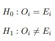
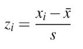
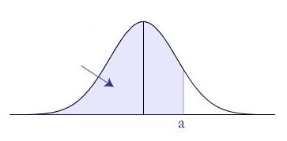
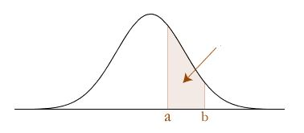
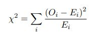

## Sequence generation
Sequences of 10 numbers are chosen at random from a normal distribution with mean 50 and standard deviation 10. 10000 such sequences are made. Now, from each of these sequences 1 number is chosen, based on a normal distribution on their indices. This normal distribution has a mean of 5 and a standard deviation of 2. Thus, we end up with a sequence of 10000 numbers(one from each of the 10000 sequences).

We have to check if this final sequence is random or belonging to a normal distribution itself. For this we use the Chi-Square goodness of fit test for a normal distribution.

## Chi-Square goodness of fit test
### Null Hypothesis
The Chi Square Goodness of fit test begins by hypothesizing that the distribution of a variable behaves in a particular manner. This hypothesis is called the null hypothesis. In this case the null hypothesis is a normal distribution with mean and standard deviation of the sequence made.

The null hypothesis is that the observed frequency in each bin is exactly equal to the expected frequency in each bin. The alternative hypothesis is that the observed and expected number of cases differ sufficiently to reject the null hypothesis.

### Computing expected frequencies
The mean and standard deviation is used to create a null hypothesis wherein the entire distribution is divided into bins of equal sizes. Here 10 bins of equal sizes are chosen with the central bin roughly lying around the mean. The edges of these bins along with the mean and standard deviation of our sequence is used to compute to compute the Z value corresponding to each edge. This is done using the following:

To compute the expected frequencies 'E' for each bin we first need to find the area(probability) below each of the of these Z values, which can be easily found using a lookup table.

Once we have the area(probability) below each Z value, we can easily compute the area between any 2 subsequent Z values, i.e. area between 2 subsequent edges, i.e. area of each bin

The expected values of each bin is now found by multiplying this area(probability) of each bin with the total values in the sequence(10000 in our case)

### Computing observed frequencies
The observed frequency 'O' can be easily computed by arranging the whole dataset into an ascending order and then computing the number of samples belonging to each of the bins.

### Computing the test statistic i.e. the Chi-square values
The Chi-square values are computed using the expected and observed values using the following:

### Computing the critical value(to compare the test statistic)
To compute the critical value we first compute the degrees of freedom for our case using "df = k - p - 1". Here k = no. of bins, p = no. of parameters.

We take the threshold significance(probability that the our hypothesis does not belong to the null hypothesis) to be 0.05 for our case.

The critical value is determined by using the degrees of freedom value and threshold significance value in a Chi-square lookup table.

### Decision
If the Chi-square value is **less** than the critical value the null hypothesis is not rejected, **proving that the sequence belongs to a normal distribution**

If the Chi-square value is **more** than the critical value then then null hypothesis is rejected, **proving that the sequence values are independent**
